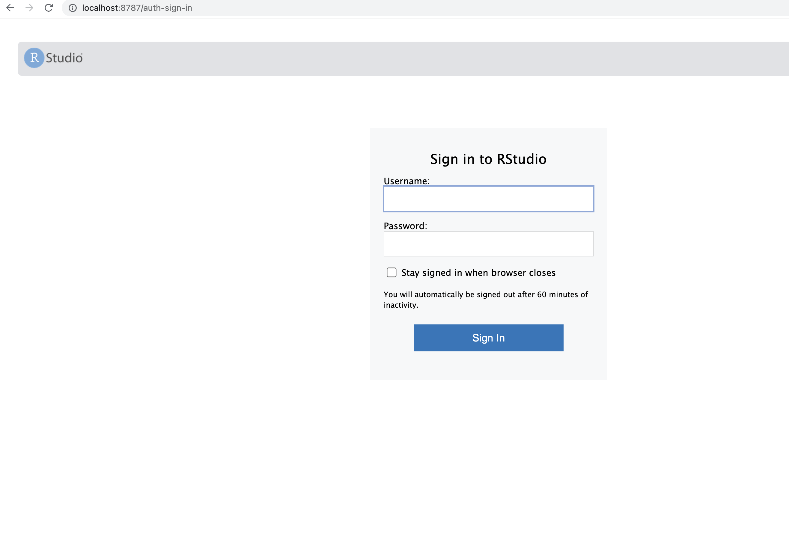

# 16S rRNA Seq-FISH Probe Design 

Designing 16S rRNA probes for bacterial communities for the seq-FISH protocol. This code requires a Docker container. 


## What is seq-FISH?
Seq-FISH stands for sequential fluorescent in situ hybridization. Commonly used for spatial transcriptomics, we adjust the method (mostly through adjusting probe design) to target bacterial 16S rRNA to visualize unique bacterial species in situ. Briefly, 30 nt length DNA probes that target a unique region of the 16S rRNA are designed with shorter 15nt length flanking sequences. These 60 nt length probes then hybridize to the target bacteria. Secondary probes that are complementary to the flanking sequence with a fluorophore then hybridize to the flanking sequence and samples can be imaged. These shorter secondary probes (readout probes) can then be stripped off, and new secondary hybridizations can happen. This is the cyclical (or sequential) nature of seq-FISH allowing for high degrees of multiplexing. The more unique flanking regions you have, the more combinatorial labelling can occur, and you can identify more bacterial species for cheaper.

Further reading about the method can be found [here](https://www.science.org/doi/10.1126/science.abi4882), [here](https://www.nature.com/articles/s41586-019-1049-y), and [here](https://www.sciencedirect.com/science/article/pii/S0092867418306470?via%3Dihub) 


## Setting up and running the docker container
This code provides a docker container to run probe design on a Mac. To set up the docker container:

1) Download and install Docker Desktop. If you are under an enterprise proxy, go to settings > resources > proxies, and update to your company proxy

2) Build the Docker container by running the following in your command line:

```bash
docker build -t "docker_image_name" - < Dockerfile_RStudio
```

You can confirm it worked by searching for the Docker container in your terminal using the `docker container ls` command

3) Run the docker container by typing the following into the command line:

``` bash
docker run --rm -p 8787:8787 -e PASSWORD=your_password -v /Users/your/path/something:/home/rstudio  docker_image_name
```

 (username is rstudio, password is whatever you set in the command) `-v` is the path to the directory that will be the volume, ie the shared directory between the docker image and your local computer.  

4) In your web browser, go to http://localhost:8787/ and enter the username and password selected above



5) In RStudio, go to the RMarkdown file  `ProbeDesign_Template.Rmd` and either complete the Probe Design process using the Test fastq files provided, or with your own fastq files following the instructions inside RMarkdown file.


## Test fastq files
As a test case and example of how to use this code, an input fastq file of 7 unique bacterial 16S rRNA sequences is provided. `Test/All7_unaligned.fasta`. All parameters that could be adjusted are in the first section of the RMarkdown file. The defaults are a good place to start and nothign is required to be changed; however, if your experimental design differs from 46 degree hybridization, 48 degree wash, 900 mM NaCl, and 20% formamide, then we suggest to update those in the first chunk of code. 

*Importantly:* This code assumes you want to design one probe per sequence. So as input, it requires a fasta or fastq file that contains only unique sequences that you want probes designed for.

 This code then:
1) Aligns the sequences in the fastq file, 
2) Creates all possible probes for each unique bacterial identifier 
3) Removes potential probes that cross-hybridize to other bacteria in your sample
4) Filters potential probes given specific experimental and probe design specifications (formamide concentration, melting temp range, GC% range etc)
5) Designs universal probes that would target all bacteria in your sample (ie: EUB probe)
6) Generates random 15 nt sequences as flanking sequences for the readout probes and adds them to the final list of potential probes
7) Confirms the new target + readout sequence doesn't cross hybridize with other designed probe combinations
8) **The output** is a csv file "probes_final_shortlist.csv" That will contain all the probe options that passed through the mismatch, melting temp, GC content, and probe:probe cross hybridization checks. Information of each probe will be listed, such as the start and end position, length, GC%, melting temp, hybridization efficiency, and formamide melting point. It is then up to you to pick the probes you want to work with. 


## Citing This Tool

Did `16S rRNA Seq-FISH Probe Design` help your research? Give me a shout-out by citing it! Simply include the following:

Taguer M (2022). 16S rRNA Seq-FISH Probe Design. v1.0.0.


## Contributing

Please feel welcome to contribute by opening a pull request.


## Dependencies 
This code heavily relies on the R package DECIPHER and their ProbeDesign workflow. 
Wright ES (2016). “Using DECIPHER v2.0 to Analyze Big Biological Sequence Data in R.” _The R Journal_,
*8*(1), 352-359.

 
## MIT license
Copyright <2022> <Mariia Taguer>

Permission is hereby granted, free of charge, to any person obtaining a copy of this software and associated documentation files (the "Software"), to deal in the Software without restriction, including without limitation the rights to use, copy, modify, merge, publish, distribute, sublicense, and/or sell copies of the Software, and to permit persons to whom the Software is furnished to do so, subject to the following conditions:

The above copyright notice and this permission notice shall be included in all copies or substantial portions of the Software.

THE SOFTWARE IS PROVIDED "AS IS", WITHOUT WARRANTY OF ANY KIND, EXPRESS OR IMPLIED, INCLUDING BUT NOT LIMITED TO THE WARRANTIES OF MERCHANTABILITY, FITNESS FOR A PARTICULAR PURPOSE AND NONINFRINGEMENT. IN NO EVENT SHALL THE AUTHORS OR COPYRIGHT HOLDERS BE LIABLE FOR ANY CLAIM, DAMAGES OR OTHER LIABILITY, WHETHER IN AN ACTION OF CONTRACT, TORT OR OTHERWISE, ARISING FROM, OUT OF OR IN CONNECTION WITH THE SOFTWARE OR THE USE OR OTHER DEALINGS IN THE SOFTWARE.
